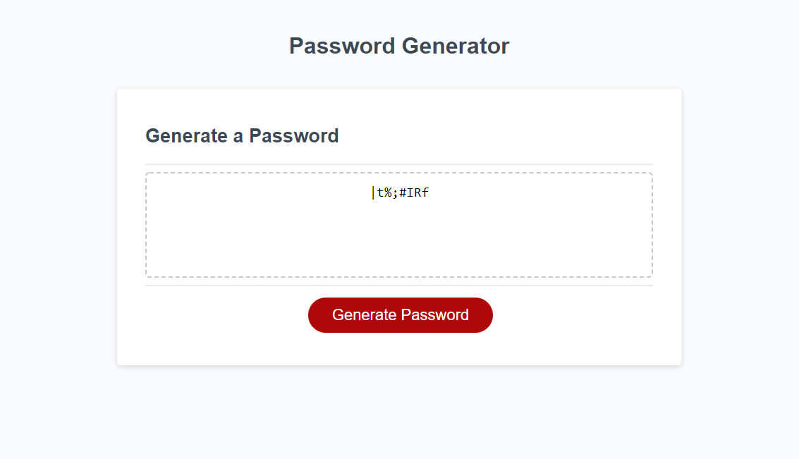

# Password Generator

## Purpose
Started with a minimal amount of code and was tasked with creating a password generator. 
The password needed to be between 8 and 128 characters long. 
The password generator need to have the ability to select different parameters (symbols, numbers, uppercase and lowercase letters) that could be included. 
All of the above parameters needed to be validated and if they fell outside what was required would create an error message and bring the user back to select the correct parameters. 

## Built With
* JavaScript
* HTML
* CSS

## Website

## Screenshot

## Contribution
Made with ❤️ by Alex Proctor